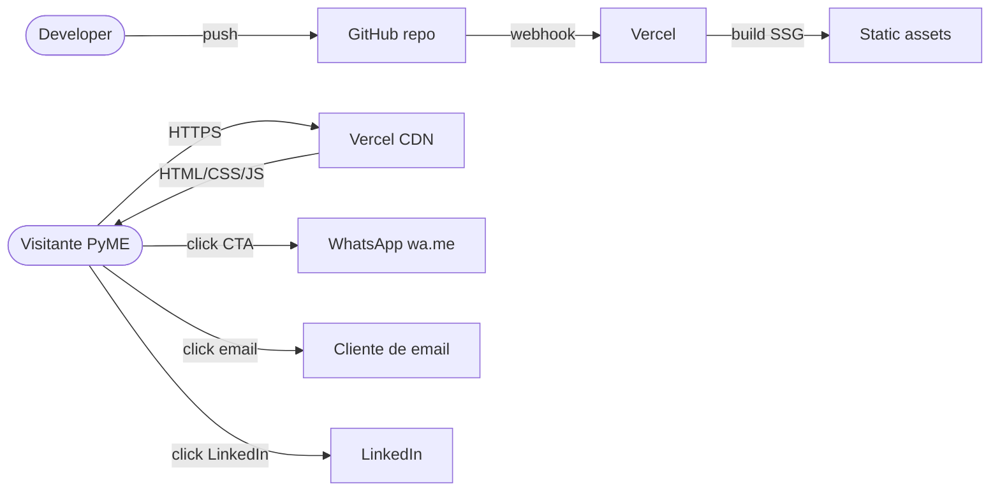
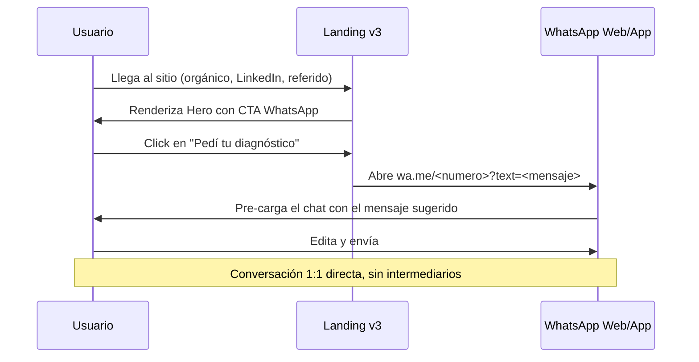

# Arquitectura — A&J Consulting IT v3

## Vista general

Sitio 100% estático. Sin backend, sin DB, sin secrets.

## Flujo de contacto

## Tabla de capas

| Capa | Tecnología | Justificación |
|---|---|---|
| Render | Next.js 14 SSG | Indexable por crawlers, sin penalty SEO |
| UI | shadcn/ui + Tailwind | Sistema de diseño consistente y accesible |
| Animaciones | framer-motion | Solo en componentes "use client" (Hero, Navbar) |
| Contacto | wa.me + mailto + LinkedIn | Sin backend, máxima conversión para target PyME |
| Deploy | Vercel | Integración nativa con Next.js |
| Datos de contacto | Módulo TS centralizado | Una sola fuente de verdad en `data/contact.ts` |

## Bundle esperado

| Recurso | Tamaño |
|---|---|
| Initial JS | ~120 kB gzip |
| Initial CSS | ~10 kB gzip |
| Fonts (Geist Sans + JetBrains Mono) | servidos por Vercel CDN |
| Imágenes | ninguna en above-the-fold |

## Performance budget

- LCP < 1.5s
- CLS < 0.1
- TTI < 2s
- Lighthouse SEO ≥ 95

## Seguridad

| Riesgo | Mitigación |
|---|---|
| XSS en formularios | No hay formularios |
| Inyección SQL | No hay DB |
| Robo de secrets | No hay secrets |
| Spam de leads | No hay endpoint que reciba datos |
| Spam de WhatsApp | wa.me no expone API; cualquier abuso queda en el inbox personal y se bloquea ahí |
| Clickjacking | `X-Frame-Options: DENY` en `next.config.mjs` |
| Tracking de referrers | `Referrer-Policy: strict-origin-when-cross-origin` |

## Decisiones explícitas

Ver `DECISIONS.md` para el log completo de ADRs.

## Roadmap arquitectónico

Si la v3 evoluciona, el camino es:

1. **v3.1** — MDX para blog. Sin backend, contenido estático.
2. **v3.2** — Casos de éxito como rutas dinámicas SSG (`/casos/[slug]`).
3. **v3.3** — Integración Calendly embebido. Sin backend propio.
4. **v3.4** — Si llega volumen, reactivar Supabase según `REINTEGRATION.md`.
